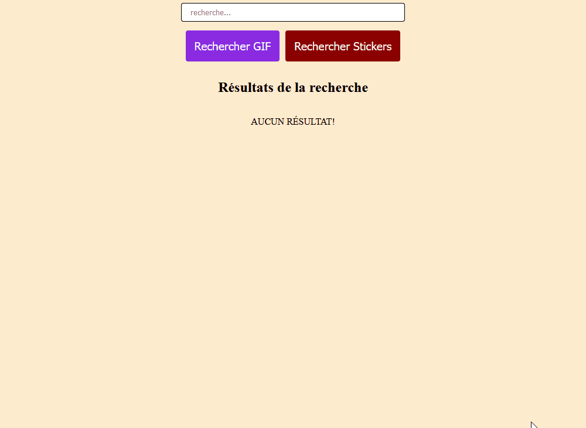

# Boite de recherche; API GIPHY

Le projet porte sur la maitrise des langages web pour construire une interface graphique. L'interface permet de télécharger des GIF et des Stickers.

| Aperçu GIF  | Aperçu Stickers  |
|:---|:---|
|  |   |

## Mise en place et structure

La structure du projet est simple.

```txt
───boite_recherche_api_giphy
    ├──sbg_sans_APIKey.html
```

Fonction: Le fichier HTML structure la seule page web pour extraire des données du web. Le fichier CSS ajoute le style à la page. Le CSS a été intégré au fichier HTML avec une balise `<style>`. Le JavaScript a été intégré au fichier HTML avec une balise `<script>`.

Le fichier HTML **ne compte pas de clé d'API**. 

Le CSS utilise principalement : tag et class, Media Queries, container, flexbox, werapper, alignment, navbar.

Le JavaScript utilise principalement : DOM, fonctions, sorties sur le terminal et à l'écran (HTML, CSS, JavaScript), évènements.

## Organisation du répertoire et exécution

Il suffit d'installer le projet. Comme le fichier HTML ne compte pas de clé d'API ni de paramètre d'API, il faut obtenir une clé de GIPHY, puis modifier cette section du fichier HTML : 

```html
<script>
  // API key and limit constants
  const APIKey = "APIKey Here"
  const APILimit = 5
  // ...
</script>
```

Ensuite, il suffit de lancer le fichier HTML pour ouvrir le projet dans un navigateur. Le fonctionnement de la page est intuitif.
